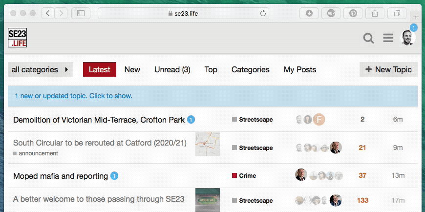

# discourse-pulsing-alerts

Theme for [Discourse](https://meta.discourse.org) forums, enabling subtle colour animation 
in blue alert badges and topic update banner

### Installation

1. Admin > Customize > Themes > Import > From the web
2. Type: https://github.com/chrisbeach/discourse-pulsing-alerts
4. Select your current theme (it's indicated with a star)
5. Under "Theme Components," select "Pulsing Alerts" and click "Add"

### Discussion

https://meta.discourse.org/t/animated-pulsing-alerts-theme/66714

### In use at:

* [SE23.life](https://se23.life)
* [SE26.life](https://se26.life)

### License 
Apache 2.0

